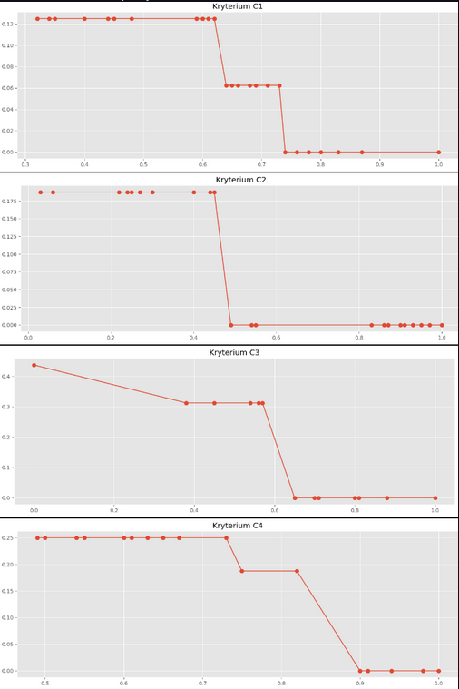
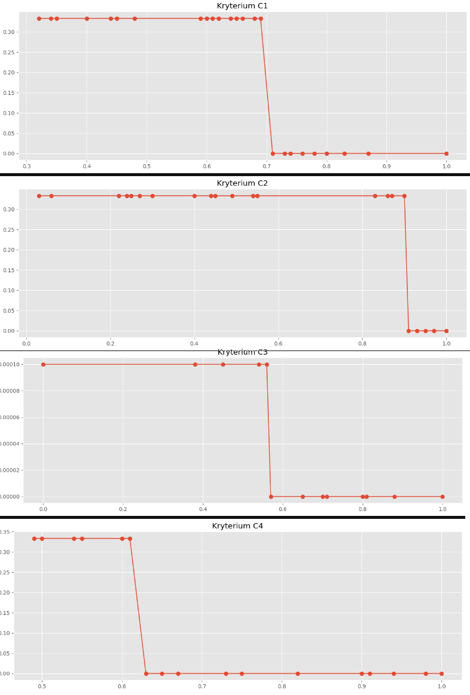
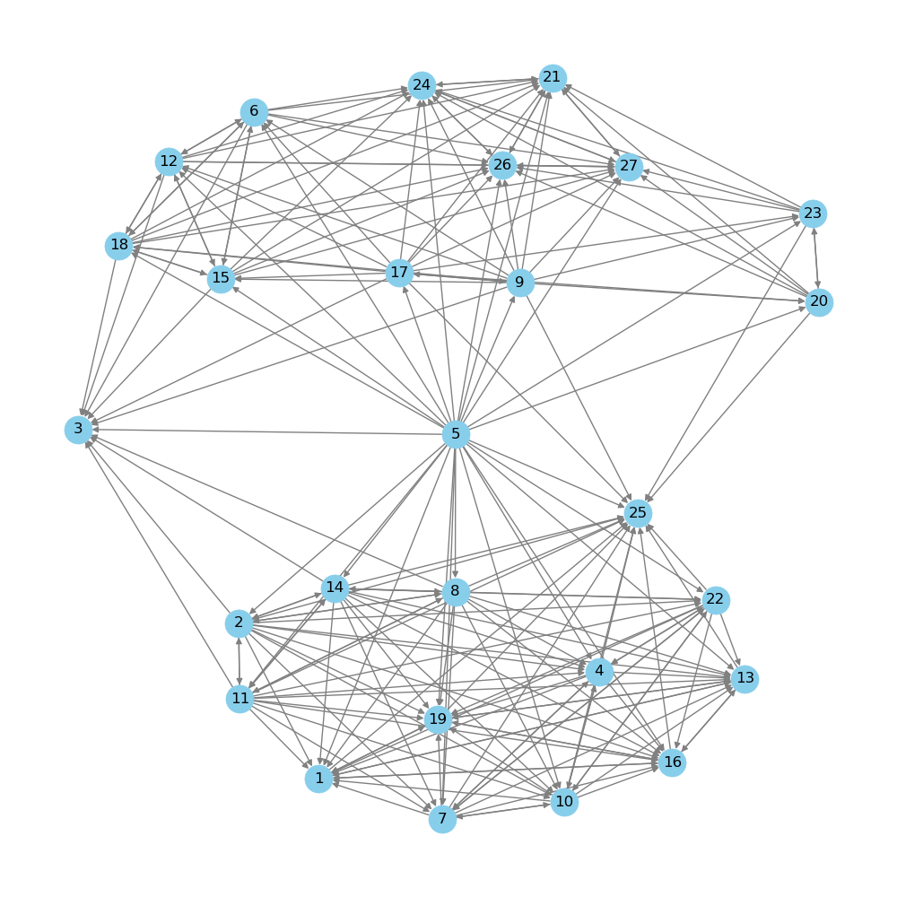
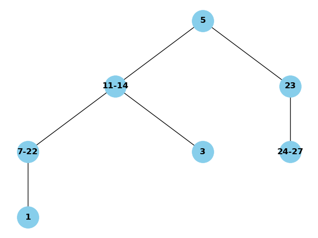
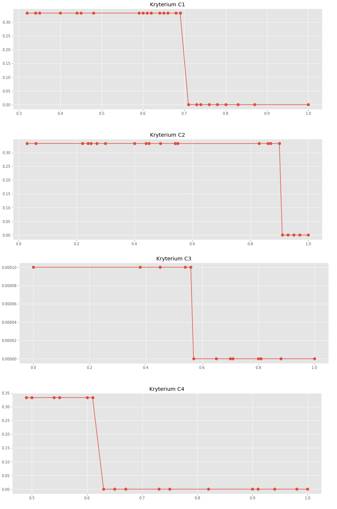

## Sprawozdanie z Projektu 1
# Inteligentne Systemy Wspomagania Decyzji

Autorzy: Kamil Kałużny, Mariusz Hybiak

## Wstęp

Zadaniem projektu było stworzenie rankingu różnych scenariuszy zarządzania odpadami radioaktywnymi z wykorzystaniem odpornej regresji porządkowej. Bazą był zbiór danych opisanym w pracy "Nuclear waste management: an application of the multicriteria PROMETHEE methods".

### Opis preferencji
Grupa 2
* W skutek wyczerpywania się złóż materiałów radioaktywnych, elektrownie mogą zacząć korzystać z bardziej ubogich złóż, co przełoży się na zwiększenie ilości odpadów radioaktywnych.

Grupa 4
* Grupa zawiera ostrożnego inwestora, który nie chce ryzykować.

### Wybrane pary wariantów referencyjncyh
|Lp. | Wariant 1 | Wariant 2|
|-|---|---|
|1.|0|4|
|2.|10|23|
|3.|2|6|
|4.|13|26|
|5.|21|22|

#### Opis kryteriów

* S1: Zakłada 10-letnie przechowywanie ILW i 30-letnie przechowywanie HLW.
* S2: Oba typy odpadów, ILW i HLW, są przechowywane przez 30 lat.
* S3: Przedłuża czas przechowywania do 50 lat zarówno dla ILW, jak i HLW

* F1 (metoda opłaty kWh): Opiera się na opłatach za każdy wyprodukowany kWh energii jądrowej, zbieranych w ciągu pierwszych 30 lat. Środki te mogą być akumulowane w funduszu powierniczym, generując odsetki na przyszłe wydatki.
* F2 (metoda prorata): Zakłada nieograniczoną odpowiedzialność producenta odpadów, który pokrywa wszystkie koszty związane z kondycjonowaniem, przechowywaniem i składowaniem odpadów, zgodnie z ich występowaniem.
* F3 (metoda opłaty za odpady): Opłaty są naliczane od producenta odpadów za każdą jednostkę dostarczanego do geologicznego składowiska odpadu. Koszty poniesione przed budową składowiska, transport i przechowywanie są finansowane bezpośrednio, a budowa składowiska jest finansowana z kredytu, który jest spłacany z wpływów z opłat.

* R1, R2, R3: możliwe lokalizacje przechowywania odpadów.

* C1 - całkowity koszt
* C2 - koszty aktualnych konsumentów
* C3 - koszty przyszłych konsumentów
* C4 - ryzyko dodatkowych kosztów

### Wybrane warianty i ich wartości na kryteriach

|Oznaczenie| Wariant | Time scenario | Site | Financing | C1 $\downarrow$ | C2 $\downarrow$ | C3 $\downarrow$ | C4 $\downarrow$ |
|-|----------|----|----|----|------|------|------|------|
|A| 0 (1)    | S1 | R1 | F1 | 0.60 | 0.93 | 0.00 | 0.73 |
|B| 4 (5)    | S1 | R2 | F2 | 0.62 | 0.40 | 0.56 | 0.50 |
|C| 10 (11)  | S2 | R1 | F2 | 0.45 | 0.86 | 0.00 | 0.73 |
|D| 23 (24)  | S3 | R2 | F3 | 0.59 | 0.24 | 0.70 | 0.63 |
|E| 2 (3)    | S1 | R1 | F3 | 1.00 | 0.45 | 0.57 | 0.50 |
|F| 6 (7)    | S1 | R3 | F1 | 0.40 | 0.90 | 0.00 | 0.82 |
|G| 13 (14)  | S2 | R2 | F2 | 0.69 | 0.49 | 0.56 | 0.61 |
|H| 26 (27)  | S3 | R3 | F3 | 0.80 | 0.06 | 1.00 | 0.67 |
|I| 21 (22)  | S3 | R2 | F1 | 0.32 | 0.83 | 0.00 | 0.94 |
|J| 22 (23)  | S3 | R2 | F2 | 0.59 | 0.24 | 0.70 | 0.63 |

### Wstępna strategia:
* Grupa 2: Zwiększenie ilości odpadów w przyszłości może zwiększyć przyszłe koszty, z tego względu najważniejsze wydaje się kryterium C3, warto również wyróżnić S1 minimalizujące długość przechowywania odpadów a także F2.

* Grupa 4: Inwestorowi zależy na stałych dochodach, bezpieczeństwie i stabilności, w tym celu szczególną uwagę trzeba poświęcić na kryterium C4 oraz niezależnym od niego finansowaniu F2.

### Zapis informacji preferencyjnej
$$
\begin{align}
    U(b) &\ge U(a) + \epsilon \\
    U(c) &\ge U(d) + \epsilon\\
    U(e) &= U(f) \\
    U(g) &\ge U(h) + \epsilon \\
    U(i) &= U(j)
\end{align}
$$

Zostało dodane dodatkowe ograniczenie, aby żadna z wag nie była większa niż 0.5 oraz nie była równa 0.

## Zadanie (3)

Wynik funkcji celu programowania matematycznego: $\epsilon = 0.0625$

Wyniki są zgodne z informacją preferencyjną. Udało się odtworzyć ranking.
Na górze rankingu (oprócz wariantów 5 i 1) znalazły się niereferencyjne warianty 10 oraz 8. Wariant 10 ma niską wartość na kryterium C3, a wariant 3 ma dość nisie wartości na kryterium C4 i C3, co sprawia, że są zgodne z obraną strategią dla obu grup.    
Wykresy funkcji użyteczności cząstkowych z uwzględnieniem wariantów nie znajdujących się w rankingu referencyjnym: 

   
Wartości użyteczności wszystkich wariantów posortowane malejąco.  
|    |   C1 |   C2 |   C3 |   C4 |     u1 |     u2 |     u3 |     u4 |      U |
|---:|-----:|-----:|-----:|-----:|-------:|-------:|-------:|-------:|-------:|
|  5 | 0.62 | 0.4  | 0.56 | 0.5  | 0.125  | 0.1875 | 0.3125 | 0.25   | 0.875  |
|  1 | 0.6  | 0.93 | 0    | 0.73 | 0.125  | 0      | 0.4375 | 0.25   | 0.8125 |
| 10 | 0.45 | 0.86 | 0    | 0.73 | 0.125  | 0      | 0.4375 | 0.25   | 0.8125 |
|  8 | 0.64 | 0.44 | 0.54 | 0.54 | 0.0625 | 0.1875 | 0.3125 | 0.25   | 0.8125 |
|  3 | 1    | 0.45 | 0.57 | 0.5  | 0      | 0.1875 | 0.3125 | 0.25   | 0.75   |
|  4 | 0.48 | 0.87 | 0    | 0.75 | 0.125  | 0      | 0.4375 | 0.1875 | 0.75   |
|  7 | 0.4  | 0.9  | 0    | 0.82 | 0.125  | 0      | 0.4375 | 0.1875 | 0.75   |
| 11 | 0.61 | 0.54 | 0.38 | 0.49 | 0.125  | 0      | 0.3125 | 0.25   | 0.6875 |
|  2 | 0.66 | 0.55 | 0.45 | 0.49 | 0.0625 | 0      | 0.3125 | 0.25   | 0.625  |
| 14 | 0.69 | 0.49 | 0.56 | 0.61 | 0.0625 | 0      | 0.3125 | 0.25   | 0.625  |
| 19 | 0.35 | 0.91 | 0    | 0.98 | 0.125  | 0      | 0.4375 | 0      | 0.5625 |
| 13 | 0.48 | 0.97 | 0    | 0.91 | 0.125  | 0      | 0.4375 | 0      | 0.5625 |
| 16 | 0.44 | 0.95 | 0    | 0.9  | 0.125  | 0      | 0.4375 | 0      | 0.5625 |
| 23 | 0.59 | 0.24 | 0.7  | 0.63 | 0.125  | 0.1875 | 0      | 0.25   | 0.5625 |
| 22 | 0.32 | 0.83 | 0    | 0.94 | 0.125  | 0      | 0.4375 | 0      | 0.5625 |
| 20 | 0.64 | 0.22 | 0.81 | 0.65 | 0.0625 | 0.1875 | 0      | 0.25   | 0.5    |
| 26 | 0.71 | 0.25 | 0.88 | 0.67 | 0.0625 | 0.1875 | 0      | 0.25   | 0.5    |
| 24 | 0.73 | 0.03 | 1    | 0.63 | 0.0625 | 0.1875 | 0      | 0.25   | 0.5    |
|  9 | 0.65 | 0.3  | 0.71 | 0.55 | 0.0625 | 0.1875 | 0      | 0.25   | 0.5    |
| 17 | 0.68 | 0.4  | 0.65 | 0.6  | 0.0625 | 0.1875 | 0      | 0.25   | 0.5    |
| 12 | 0.74 | 0.25 | 0.8  | 0.49 | 0      | 0.1875 | 0      | 0.25   | 0.4375 |
| 21 | 0.83 | 0.25 | 0.8  | 0.65 | 0      | 0.1875 | 0      | 0.25   | 0.4375 |
| 18 | 0.76 | 0.06 | 1    | 0.6  | 0      | 0.1875 | 0      | 0.25   | 0.4375 |
| 15 | 0.87 | 0.03 | 1    | 0.61 | 0      | 0.1875 | 0      | 0.25   | 0.4375 |
|  6 | 0.78 | 0.27 | 0.71 | 0.5  | 0      | 0.1875 | 0      | 0.25   | 0.4375 |
| 27 | 0.8  | 0.06 | 1    | 0.67 | 0      | 0.1875 | 0      | 0.25   | 0.4375 |
| 25 | 0.34 | 1    | 1    | 1    | 0.125  | 0      | 0      | 0      | 0.125  |

Na podstawie wariantów nierefrencyjnych z powyższej tabeli widać że uzyskany ranking jest zgodny z naszymi założeniami, najważniejszymi kryteriami w kontekście użyteczności wydają się być C3 i C4. Na końcu znalazły się warianty z kiepskimi ocenami na tym kryterium.

## Zadanie (4)

Wynik funkcji celu programowania matematycznego: $\epsilon \approx 0.66$

W tym wypadku model również jest spójny z zadaną informacją preferencyjną.

Wykresy funkcji użyteczności cząstkowych: 

Wartości użyteczności wszystkich wariantów posortowane malejąco:
|    |   C1 |   C2 |   C3 |   C4 |       u1 |       u2 |     u3 |       u4 |        U |
|---:|-----:|-----:|-----:|-----:|---------:|---------:|-------:|---------:|---------:|
|  5 | 0.62 | 0.4  | 0.56 | 0.5  | 0.333267 | 0.333267 | 0.0001 | 0.333367 | 1        |
| 14 | 0.69 | 0.49 | 0.56 | 0.61 | 0.333267 | 0.333167 | 0.0001 | 0.333367 | 0.9999   |
| 11 | 0.61 | 0.54 | 0.38 | 0.49 | 0.333267 | 0.333167 | 0.0001 | 0.333367 | 0.9999   |
| 17 | 0.68 | 0.4  | 0.65 | 0.6  | 0.333267 | 0.333267 | 0      | 0.333367 | 0.9999   |
|  2 | 0.66 | 0.55 | 0.45 | 0.49 | 0.333267 | 0.333167 | 0.0001 | 0.333367 | 0.9999   |
|  8 | 0.64 | 0.44 | 0.54 | 0.54 | 0.333267 | 0.333167 | 0.0001 | 0.333367 | 0.9999   |
|  9 | 0.65 | 0.3  | 0.71 | 0.55 | 0.333267 | 0.333267 | 0      | 0.333367 | 0.9999   |
| 15 | 0.87 | 0.03 | 1    | 0.61 | 0        | 0.333267 | 0      | 0.333367 | 0.666633 |
| 12 | 0.74 | 0.25 | 0.8  | 0.49 | 0        | 0.333267 | 0      | 0.333367 | 0.666633 |
| 18 | 0.76 | 0.06 | 1    | 0.6  | 0        | 0.333267 | 0      | 0.333367 | 0.666633 |
|  6 | 0.78 | 0.27 | 0.71 | 0.5  | 0        | 0.333267 | 0      | 0.333367 | 0.666633 |
| 20 | 0.64 | 0.22 | 0.81 | 0.65 | 0.333267 | 0.333267 | 0      | 0        | 0.666533 |
|  7 | 0.4  | 0.9  | 0    | 0.82 | 0.333267 | 0.333167 | 0.0001 | 0        | 0.666533 |
| 23 | 0.59 | 0.24 | 0.7  | 0.63 | 0.333267 | 0.333267 | 0      | 0        | 0.666533 |
|  4 | 0.48 | 0.87 | 0    | 0.75 | 0.333267 | 0.333167 | 0.0001 | 0        | 0.666533 |
| 22 | 0.32 | 0.83 | 0    | 0.94 | 0.333267 | 0.333167 | 0.0001 | 0        | 0.666533 |
|  3 | 1    | 0.45 | 0.57 | 0.5  | 0        | 0.333167 | 0      | 0.333367 | 0.666533 |
| 10 | 0.45 | 0.86 | 0    | 0.73 | 0.333267 | 0.333167 | 0.0001 | 0        | 0.666533 |
|  1 | 0.6  | 0.93 | 0    | 0.73 | 0.333267 | 0        | 0.0001 | 0        | 0.333367 |
| 19 | 0.35 | 0.91 | 0    | 0.98 | 0.333267 | 0        | 0.0001 | 0        | 0.333367 |
| 16 | 0.44 | 0.95 | 0    | 0.9  | 0.333267 | 0        | 0.0001 | 0        | 0.333367 |
| 13 | 0.48 | 0.97 | 0    | 0.91 | 0.333267 | 0        | 0.0001 | 0        | 0.333367 |
| 21 | 0.83 | 0.25 | 0.8  | 0.65 | 0        | 0.333267 | 0      | 0        | 0.333267 |
| 24 | 0.73 | 0.03 | 1    | 0.63 | 0        | 0.333267 | 0      | 0        | 0.333267 |
| 25 | 0.34 | 1    | 1    | 1    | 0.333267 | 0        | 0      | 0        | 0.333267 |
| 26 | 0.71 | 0.25 | 0.88 | 0.67 | 0        | 0.333267 | 0      | 0        | 0.333267 |
| 27 | 0.8  | 0.06 | 1    | 0.67 | 0        | 0.333267 | 0      | 0        | 0.333267 |

Wyznaczony ranking odzwierciedla nasze wstępne założenia - aż 6 z 7 wariantów o najwyższej użyteczności globalnej to reprezentanci finansowania z klasy F2. Nie widać natomiast szczególnych trendów związanych z typem S1 opisanym w naszej strategii. Jednak ze względu na fakt, że przyjęliśmy klasę F2 za ważną dla obu grup decydentów, jesteśmy zadowoleni z tego wyniku. Co ciekawe na końcu rankingu znalazła się większość wariantów z klasy S3.

Diagram Hasse'go:  

Jak widać na załączonym obrazku diagram dla wszystkich wariantów jest bardzo nieczytelny, dlatego załączamy również jego podzbiór rozważający tylko nasze warianty znajdujące się w informacji preferencyjnej:  

Uzyskane z tabeli z wartościami użyteczności relacje konieczne i możliwe są spójne. Wskazuje na to również powyższy podzbiór diagramu Hasse'go, nastęouje w nim pełne odwzorowanie informacji preferencyjnej dla preferencji wariantu 5 nad 1. Jest w nim również dużo wariantów nieporównywalnych. 

## Zadanie (5)

Wynik funkcji celu programowania matematycznego: $M\epsilon - \delta = 66666.667$.

Wykresy funkcji użyteczności cząstkowych: 

|    |   C1 |   C2 |   C3 |   C4 |       u1 |       u2 |     u3 |       u4 |        U |
|---:|-----:|-----:|-----:|-----:|---------:|---------:|-------:|---------:|---------:|
|  5 | 0.62 | 0.4  | 0.56 | 0.5  | 0.333267 | 0.333267 | 0.0001 | 0.333367 | 1        |
| 14 | 0.69 | 0.49 | 0.56 | 0.61 | 0.333267 | 0.333167 | 0.0001 | 0.333367 | 0.9999   |
| 11 | 0.61 | 0.54 | 0.38 | 0.49 | 0.333267 | 0.333167 | 0.0001 | 0.333367 | 0.9999   |
| 17 | 0.68 | 0.4  | 0.65 | 0.6  | 0.333267 | 0.333267 | 0      | 0.333367 | 0.9999   |
|  2 | 0.66 | 0.55 | 0.45 | 0.49 | 0.333267 | 0.333167 | 0.0001 | 0.333367 | 0.9999   |
|  8 | 0.64 | 0.44 | 0.54 | 0.54 | 0.333267 | 0.333167 | 0.0001 | 0.333367 | 0.9999   |
|  9 | 0.65 | 0.3  | 0.71 | 0.55 | 0.333267 | 0.333267 | 0      | 0.333367 | 0.9999   |
| 15 | 0.87 | 0.03 | 1    | 0.61 | 0        | 0.333267 | 0      | 0.333367 | 0.666633 |
| 12 | 0.74 | 0.25 | 0.8  | 0.49 | 0        | 0.333267 | 0      | 0.333367 | 0.666633 |
| 18 | 0.76 | 0.06 | 1    | 0.6  | 0        | 0.333267 | 0      | 0.333367 | 0.666633 |
|  6 | 0.78 | 0.27 | 0.71 | 0.5  | 0        | 0.333267 | 0      | 0.333367 | 0.666633 |
| 20 | 0.64 | 0.22 | 0.81 | 0.65 | 0.333267 | 0.333267 | 0      | 0        | 0.666533 |
|  7 | 0.4  | 0.9  | 0    | 0.82 | 0.333267 | 0.333167 | 0.0001 | 0        | 0.666533 |
| 23 | 0.59 | 0.24 | 0.7  | 0.63 | 0.333267 | 0.333267 | 0      | 0        | 0.666533 |
|  4 | 0.48 | 0.87 | 0    | 0.75 | 0.333267 | 0.333167 | 0.0001 | 0        | 0.666533 |
| 22 | 0.32 | 0.83 | 0    | 0.94 | 0.333267 | 0.333167 | 0.0001 | 0        | 0.666533 |
|  3 | 1    | 0.45 | 0.57 | 0.5  | 0        | 0.333167 | 0      | 0.333367 | 0.666533 |
| 10 | 0.45 | 0.86 | 0    | 0.73 | 0.333267 | 0.333167 | 0.0001 | 0        | 0.666533 |
|  1 | 0.6  | 0.93 | 0    | 0.73 | 0.333267 | 0        | 0.0001 | 0        | 0.333367 |
| 19 | 0.35 | 0.91 | 0    | 0.98 | 0.333267 | 0        | 0.0001 | 0        | 0.333367 |
| 16 | 0.44 | 0.95 | 0    | 0.9  | 0.333267 | 0        | 0.0001 | 0        | 0.333367 |
| 13 | 0.48 | 0.97 | 0    | 0.91 | 0.333267 | 0        | 0.0001 | 0        | 0.333367 |
| 21 | 0.83 | 0.25 | 0.8  | 0.65 | 0        | 0.333267 | 0      | 0        | 0.333267 |
| 24 | 0.73 | 0.03 | 1    | 0.63 | 0        | 0.333267 | 0      | 0        | 0.333267 |
| 25 | 0.34 | 1    | 1    | 1    | 0.333267 | 0        | 0      | 0        | 0.333267 |
| 26 | 0.71 | 0.25 | 0.88 | 0.67 | 0        | 0.333267 | 0      | 0        | 0.333267 |
| 27 | 0.8  | 0.06 | 1    | 0.67 | 0        | 0.333267 | 0      | 0        | 0.333267 |

Ranking wariantów, wygenerowany w oparciu o reprezentatywną funkcję użyteczności, jest zgodny ze strategią decydenta oraz z uwzględnionymi przez niego preferencjami. Warianty, które znalazły się na czołowych pozycjach rankingu, charakteryzują się niskimi wartościami na kryterium C4 (ryzyko dodatkowych kosztów), co jest zgodne z założeniami grupy 2 i 4. Solver zminimalizował tu rolę kryterium C3 ustawiając niską wagę.

Porównując wyniki z wynikami z zadania (3) można zauważyć, że na pierwszym miejscu w rankingu znalazł się ten sam wariant 5, podobnie na końcu jest wariant 25. Tabele różnią się jednak zdecydowanie kolejnością wariantów pomiędzy tymi dwoma zadaniami. Zachowany został jednak ogólny trend i odtworzony zadany ranking.